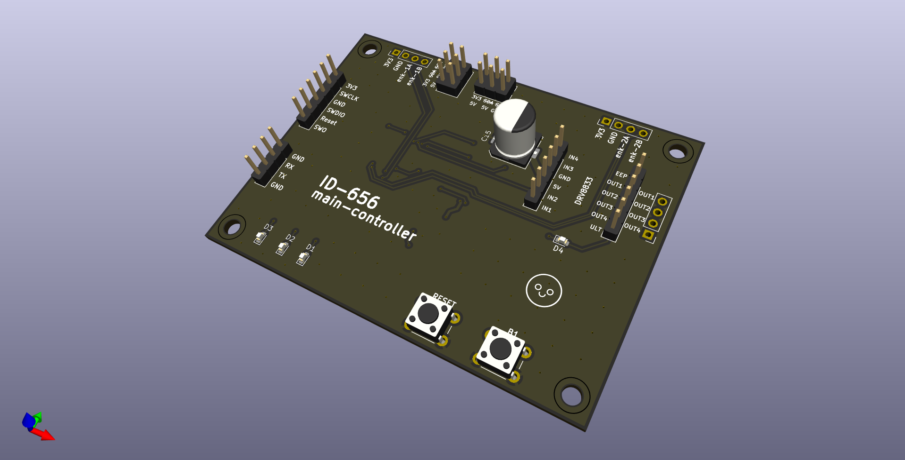
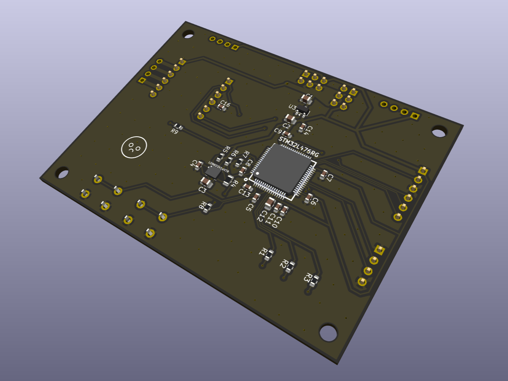
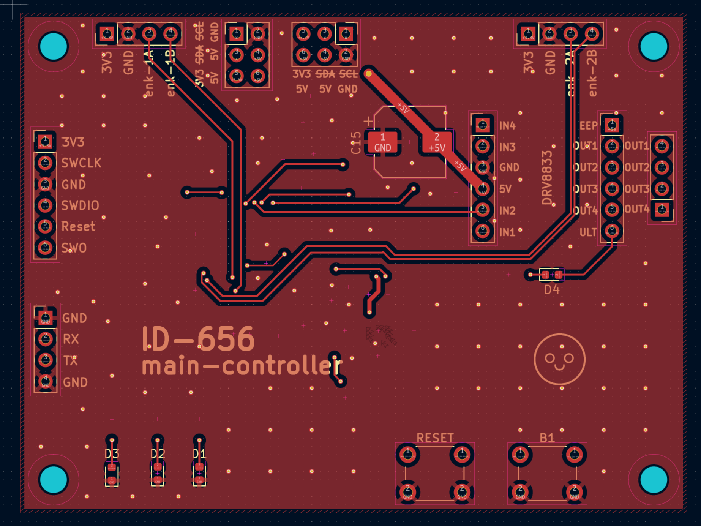
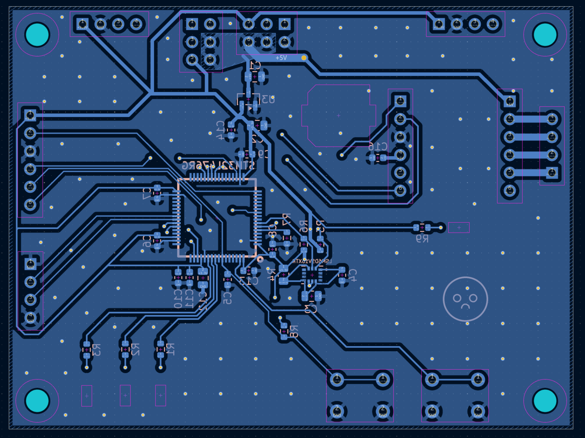
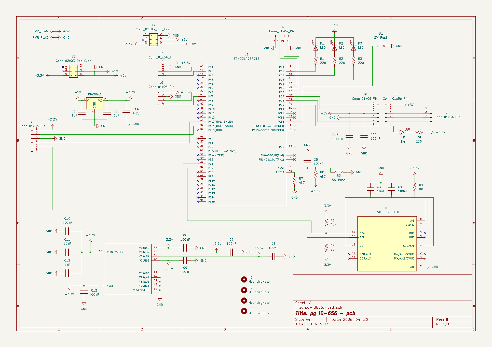

# pg-id-656-main-controller-pcb
Custom PCB controller board for an [autonomous wheeled robot](https://github.com/adasbl/Projekt-Grupowy-ID-656.git) featuring **STM32L476RG**

    

## Project Scope & Features
* **Design:** Mixed-signal schematic and custom 2-layer PCB layout designed in **KiCad 9.0.5**.
* **Core Architecture:** Driven by the ARM Cortex-M4 **STM32L476RGT6** MCU, paired with a **DI6206** 3.3V LDO linear regulator for clean logic power management.
* **Motion & Power Control:** Integrated female header socket sockets designed for direct mounting of a **DRV8833** dual H-bridge motor driver breakout module.
  * Hardware-level fault protection monitoring via a dedicated active-low emergency fault indicator LED connected directly to the driver's `nFAULT` pin (signals overcurrent, thermal shutdown, or undervoltage conditions).
* **Sensing & Odometry:**
  * Onboard ultra-low-power **LSM6DSV16X** 6-axis IMU communicating via I2C for inertial navigation.
  * Dedicated dual **Encoder input ports** providing +5V power and bidirectional hardware interrupt channels for precise wheel speed and position tracking.
* **User Interface & Diagnostics:** General-purpose status and user LEDs for runtime debugging.
  * Onboard tactile user buttons and a hardware reset line.

## pcb photos and renders:

  
  

  
  

## pcb layout:

  
  

  
  

## circuit diagram:

  

## Repository Structure
* `3Dmodels/` – 3D STEP/STL models.
* `gerbers/` – Production-ready Gerber and drill files.
* `images/` – 3D renders, schematic exports, and photos.
* `KiCad-files/` – KiCad project source files (`.kicad_pro`, `.kicad_sch`, `.kicad_pcb`).
* `id-656-pcb_v8.pdf` – PDF export of the PCB layout.
* `id-656-schematics_v8.pdf` – PDF export of the schematic diagram.
