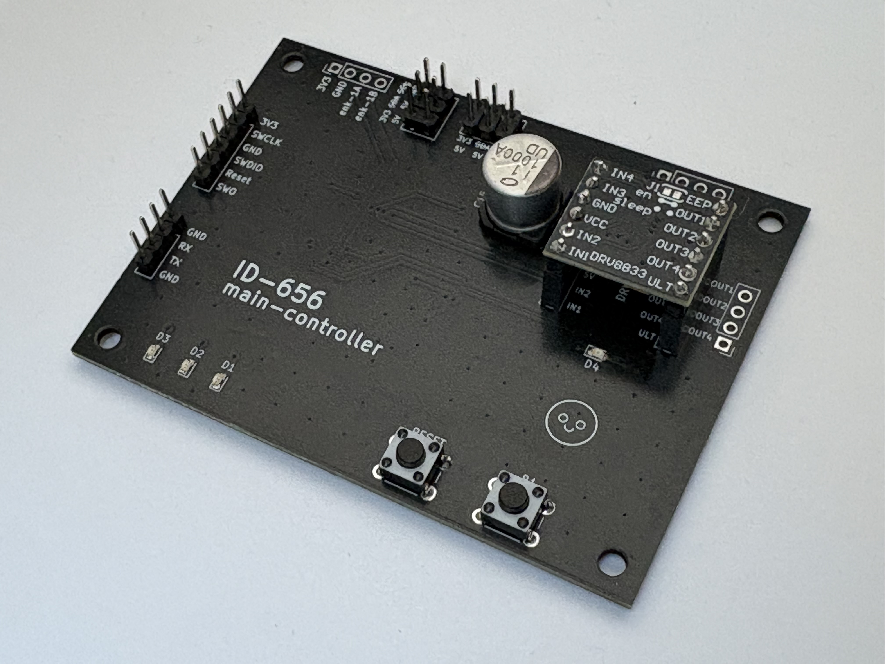
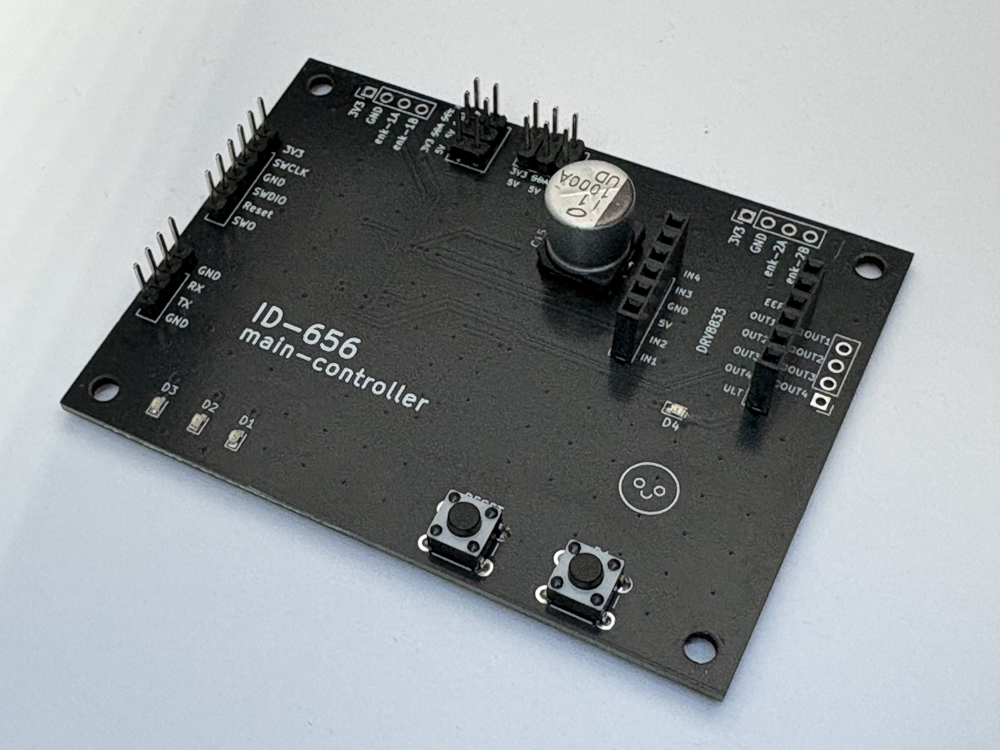
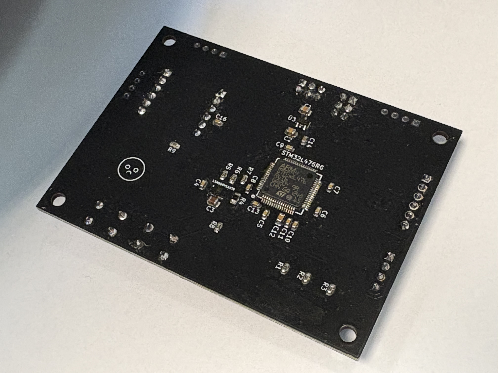
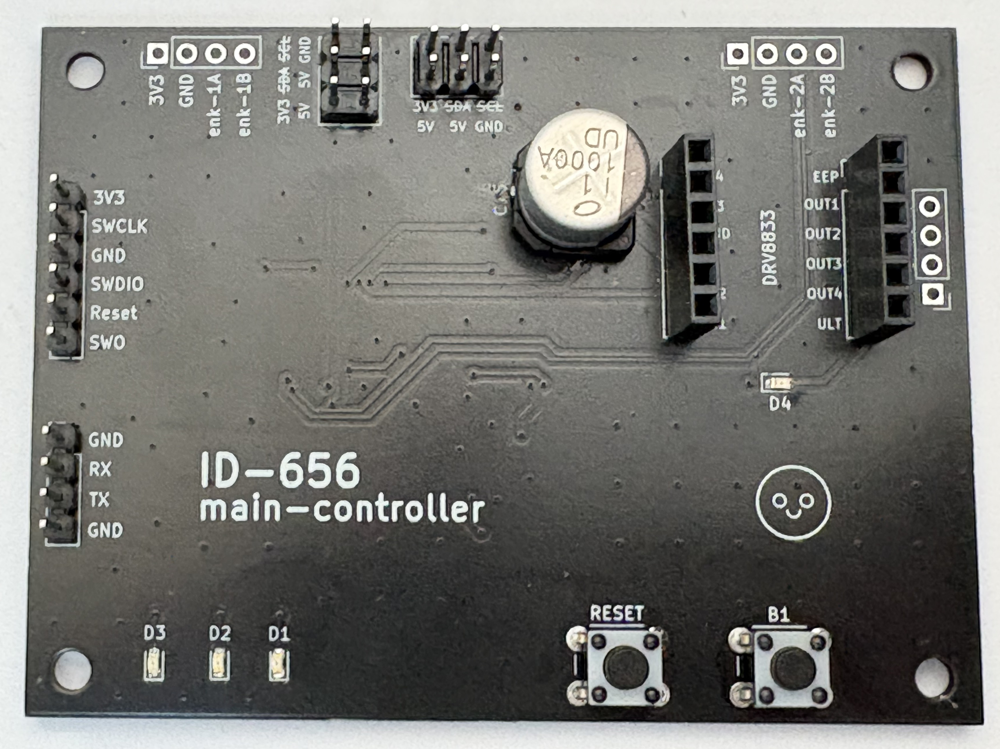
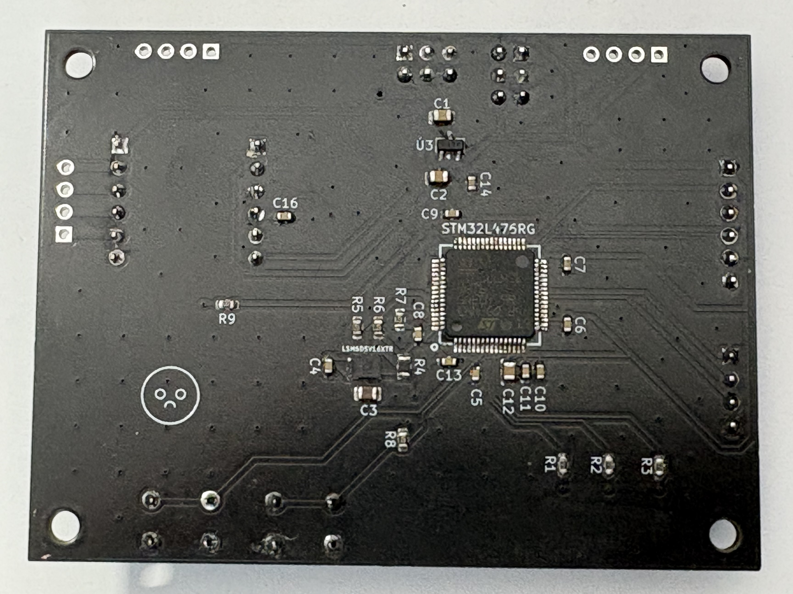

# pg-id-656-main-controller-pcb
Custom PCB controller board for an autonomous wheeled robot featuring **STM32L476RG**

    

## Project Scope
* **Design:** Mixed-signal schematic and custom 2-layer PCB layout designed in **KiCad 9.0.5**.
* **Hardware:** Microcontroller-driven architecture utilizing an ARM Cortex-M4 **STM32L476RGT6**, an **LSM6DSV16X** 6-axis IMU via I2C, and a **DI6206** 3.3V LDO linear regulator for logic power management.
* **Interfaces:** Features onboard SWD programming header, UART comunication port, motor driver connectors, encoder inputs, status LEDs, and user buttons.
* **Assembly:** Surface-mount technology (SMT) featuring 0603 and 0805 passive components, LQFP-64, and LGA-14 IC packages.

### pcb photos and renders:

  
  

  
  

### pcb layout:

  
  

  
  

### circuit diagram:

  

## Repository Structure
* `pg-id656.kicad_pro` – Main KiCad project file.
* `pg-id656.kicad_sch` – Schematic source file.
* `pg-id656.kicad_pcb` – PCB layout source file.
* `/images` – PCB 3D renders, schematic exports, and physical project photos.